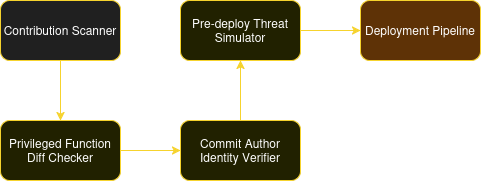

# OCCA
Olympix Code Contribution Analyzer (OCCA), is a Code Contribution and Deployment Analyzer platform tailored for smart contract environments.

OCCA targets cases like the Munchables Hack (March 2024).

## The Munchables Hack
The Munchables hack is a case study of the importance of vetting and performing background checks for critical team members of a DeFi team. In this case, the project hired four developers believed to be the same person — and suspected to be from North Korea — to create its smart contracts.

When the Munchables developer created the project, they built it using an upgradeable proxy contract, which could be modified by the deployer’s address. Furthermore, this deployer address was owned by the developer, not the Munchables contract.

The attacker used their control over the project’s smart contract to assign themselves a balance of 1 million ETH within the smart contract. Later, the contract was upgraded to a secure version; however, the attacker’s manipulation of the storage slots remained.

Once this balance was in place, the attacker simply had to wait until enough ETH had been deposited in the smart contract to make an attack worthwhile. When they struck, they were able to transfer about $62.5 million worth of ETH into their wallets.

After the hack occurred, ZachXBT investigated and determined that all four of the attackers were likely the same person and potentially linked to the Lazarus Group. This revelation might have been the impetus for the attackers to hand over the private keys needed to restore $60.5 million of the stolen funds to the Munchables project.

### The Root Cause
The root causes are the following:

#### Malicious Developer Insertion:
- The attacker embedded backdoors in smart contracts during development.
- Specifically, they inserted logic that allowed them to set arbitrary balances for themselves.

#### Lack of Audit or Inadequate Review:
- Code was deployed without thorough peer review or external auditing.
- Critical functions were not protected adequately by role-based access control.

#### Privileged Role Exploitation:
- The attacker leveraged a privileged function to mint or withdraw funds at will.

## High Level Architecture Diagram
This is a high level architecture diagram where its components might be part of a larger architecture.



## Components explained
Here the components of the diagrama explained.

### Smart Contract Contribution Scanner (SCCS)

#### Function:
Scans every pull request or commit for malicious patterns and anomalous logic.

#### Approach:
- Might use SST (Abstract Syntax Tree) analysis to detect dangerous patterns like:
  - Hardcoded addresses.
  - Hidden admin functions.
  - Privileged `setBalance`, `transferFrom` functions not tied to proper access controls.
- Machine Learning model trained on malicious smart contract datasets

### Privileged Function Diff Checker
- Compares new commits to existing contract code and flags:
  - Functions that can move or alter balances.
  - Functions with `onlyOwner`, `admin` tags that were recently added.
  - Shows a _Privileged Code Delta_ report with risk scores.

### Commit Author Identity Verifier
- Multi-signature approval for code changes made by not fully trusted developers.
- Mandatory peer review on all admin logics.

### Pre-Deploy Threat Simulator
- Simulates interactions between contracts using symbolic execution and fuzzing
- Detects:
  - Unauthorized fund flows
  - State manipulation paths
  - Access control bypasses

### Deployment Pipeline
- Code is passed to the Deployment pipeline.

## Improvements
Since it is just a PoC, there a lot of room for improvements:
- Deployment pipelines hooks could be added.
  - Prevent deployment if unaudited privileged logic is present.

## Requirements
Tested on:
- Debian 12
- Python 3.11
- solc 0.8.29
- slither-analyzer 0.11.0

## Install rquirements
Create venv and install requirements.
```
python3 -m venv v-env
pip install -r requirements.txt
solc-select install 0.8.29
solc-select use 0.8.29
```

## Running the PoC
```
python src/code-scanner.py
```

## Running Docker container
The Docker image can pull and run by pulling from DockerHub:
```
sudo docker pull theslackone/scanner
sudo docker run theslackone/scanner
```

## Building Docker image and run
```
docker build -t scanner .
docker run scanner
```

# References
- [The Munchables hack explained](https://www.halborn.com/blog/post/explained-the-munchables-hack-march-2024)
- [Slither](https://github.com/crytic/slither)
